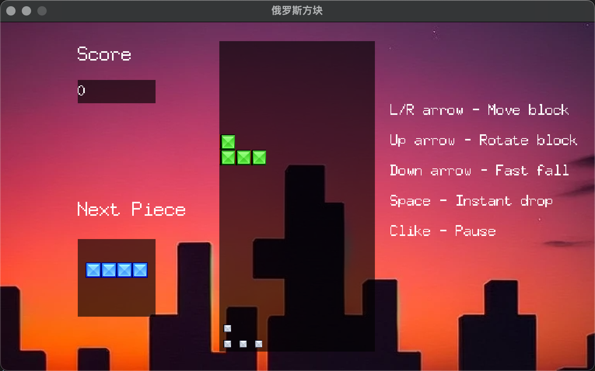

# Tetris implements by go

## Running the Game

Having Go installed, you can run `go run .` from the root directory to play the game.

example:

## Controls

- Left/Right arrow - Move piece
- Up arrow - Rotate piece
- Down arrow - Fast fall
- Space - Instant drop
- Clike - Pause
## Todo

- [ ] Menus (Opening, game-over)
- [ ] Animation for row clearing
- [ ] Music and sound effects
